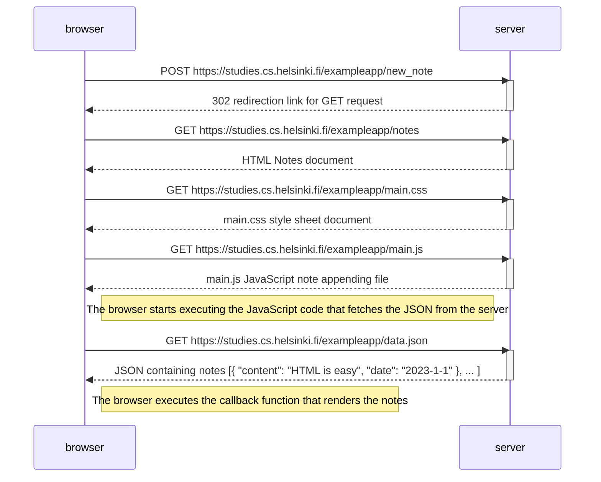

```mermaid
sequenceDiagram

    %% define participants

    participant browser
    participant server

    %% new note generation event with redirect

    browser->>server: POST https://studies.cs.helsinki.fi/exampleapp/new_note

    activate server
    server-->>browser: 302 redirection link for GET request
    deactivate server

    %% GET to fetch HTML data

    browser->>server: GET https://studies.cs.helsinki.fi/exampleapp/notes

    activate server
    server-->>browser: HTML Notes document
    deactivate server

    %% GET to fetch stylesheet
    %% I assume stylesheet is called first, as it is mentioned earlier in the <head>

    browser->>server: GET https://studies.cs.helsinki.fi/exampleapp/main.css

    activate server
    server-->>browser: main.css style sheet document
    deactivate server

    %% GET to fetch javascript
    browser->>server: GET https://studies.cs.helsinki.fi/exampleapp/main.js

    activate server
    server-->>browser: main.js JavaScript note appending file
    deactivate server

    Note right of browser: The browser starts executing the JavaScript code that fetches the JSON from the server

    %% JS file causes fetching of data.json

    browser->>server: GET https://studies.cs.helsinki.fi/exampleapp/data.json

    activate server
    server-->>browser: JSON containing notes [{ "content": "HTML is easy", "date": "2023-1-1" }, ... ]
    deactivate server

    Note right of browser: The browser executes the callback function that renders the notes

    


```