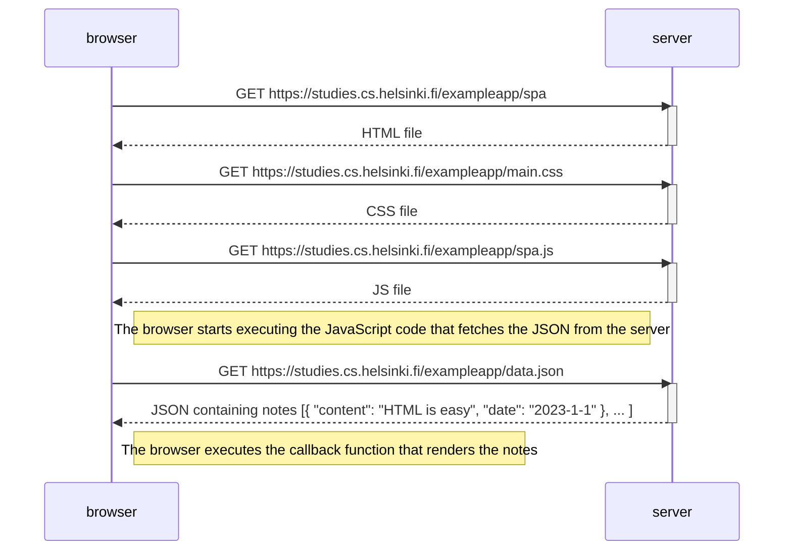

```mermaid
sequenceDiagram
    participant browser
    participant server
    
    browser->>server: GET https://studies.cs.helsinki.fi/exampleapp/spa
    activate server
    server-->>browser: HTML file
    deactivate server

    %% HTML file calls the main.css file
    browser->>server: GET https://studies.cs.helsinki.fi/exampleapp/main.css
    activate server
    server-->>browser: CSS file
    deactivate server

    %% HTML file calls spa.js file
    browser->>server: GET https://studies.cs.helsinki.fi/exampleapp/spa.js
    activate server
    server-->>browser: JS file
    deactivate server
    Note right of browser: The browser starts executing the JavaScript code that fetches the JSON from the server

    %% JS fetchen JSON from the server
    browser->>server: GET https://studies.cs.helsinki.fi/exampleapp/data.json
    activate server
    server-->>browser: JSON containing notes [{ "content": "HTML is easy", "date": "2023-1-1" }, ... ]
    deactivate server
    Note right of browser: The browser executes the callback function that renders the notes

```