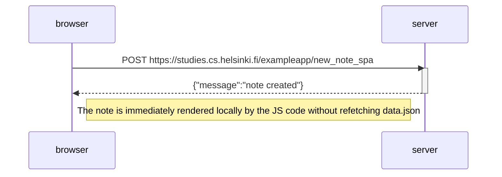

```mermaid
sequenceDiagram
    participant browser
    participant server

    %% browser creates a POST request
    browser->>server: POST https://studies.cs.helsinki.fi/exampleapp/new_note_spa
    
    activate server
    server-->>browser: {"message":"note created"}
    deactivate server

    %% browser immediately shows note
    Note right of browser: The note is immediately rendered locally by the JS code without refetching data.json

```